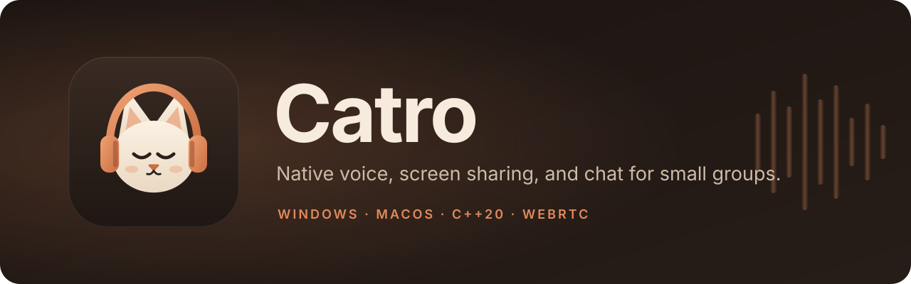
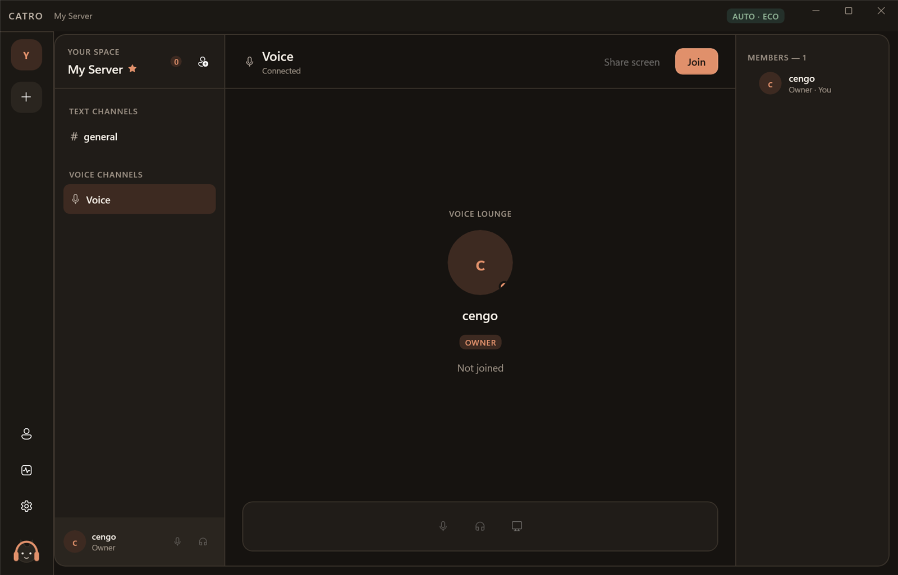

<p align="center">
  
</p>

<p align="center">
  <a href="https://github.com/brutalstein/catro/releases/latest/download/Catro-windows-x64.zip"></a>
  <a href="https://github.com/brutalstein/catro/releases/latest/download/Catro-macos-arm64.zip"></a>
  <a href="https://github.com/brutalstein/catro/releases/latest/download/Catro-macos-x64.zip"></a>
</p>

<p align="center">
  <a href="https://github.com/brutalstein/catro/releases/latest"></a>
  
  
</p>

<p align="center">
  <b>Talk, share your screen, and chat with your friends.</b><br>
  A small, fast app for Windows and Mac. No account, no password.
</p>

<p align="center">
  
</p>

## What it does

- **Voice chat**: join a voice channel with one click, up to 5 people.
- **Screen sharing**: share your whole screen, a window or a game, with its sound.
- **Text chat**: every server has a `#general` channel that keeps its history.
- **Invites**: send friends a code to join your server.
- **Windows and Mac together**: everyone shares the same servers and streams.
- **Updates itself**: when a new version is out, an **Update** button appears in the app.

## Download

| Your computer | Download |
| --- | --- |
| **Windows 10 / 11** | [Catro-windows-x64.zip](https://github.com/brutalstein/catro/releases/latest/download/Catro-windows-x64.zip) |
| **Mac with Apple chip** (M1, M2, M3, M4…) | [Catro-macos-arm64.zip](https://github.com/brutalstein/catro/releases/latest/download/Catro-macos-arm64.zip) |
| **Mac with Intel chip** | [Catro-macos-x64.zip](https://github.com/brutalstein/catro/releases/latest/download/Catro-macos-x64.zip) |

These links always give you the newest version. All versions: [Releases](https://github.com/brutalstein/catro/releases).

**Windows:** unzip the file and open `Catro.exe`.
**Mac:** unzip the file and move `Catro.app` to Applications.

## Install with one command (recommended)

This downloads the newest version, checks it, installs it, and adds a shortcut. Run it again any time to update.

**Windows**: open **PowerShell** and paste:

```powershell
irm https://github.com/brutalstein/catro/releases/latest/download/install-windows.ps1 | iex
```

**Mac**: open **Terminal** and paste:

```bash
curl -fsSL https://github.com/brutalstein/catro/releases/latest/download/install-macos.sh | sh
```

## First time opening

Catro is not signed by Apple or Microsoft yet, so your computer may warn you once.

- **Windows:** if you see "Windows protected your PC", click **More info** and then **Run anyway**.
- **Mac:** if it will not open, right-click `Catro.app`, choose **Open**, then **Open** again. You do not need this step if you used the Terminal command.
- **Mac:** allow **Microphone** when you join voice and **Screen Recording** when you share your screen. Then restart Catro.

## How to use

1. Open Catro. Your own server is ready.
2. Set your name in **Profile** (Windows) or **Settings** (Mac).
3. Invite friends with the invite button next to your server name.
4. Click **Voice**, then **Join**.
5. Click **Share screen** and pick a screen, window, or game.

## Requirements

- **Windows:** Windows 10 (version 2004 or newer) or Windows 11, 64-bit. Screen sharing needs a graphics card from the last several years (NVIDIA, AMD, or Intel).
- **Mac:** macOS 12.3 Monterey or newer. Sharing sound needs macOS 13 or newer.

## Uninstall

**Windows**: if you used the command above, run this in PowerShell:

```powershell
irm https://github.com/brutalstein/catro/releases/latest/download/uninstall-windows.ps1 | iex
```

If you used the zip, delete the folder.

**Mac:** move `Catro.app` to the Trash.

## Privacy

- No email, phone number, or password. Your identity is created on your computer and stays there.
- Voice and video are encrypted.

Found a problem? [Report it here](https://github.com/brutalstein/catro/issues). Security issues: [SECURITY.md](SECURITY.md).

<details>
<summary><b>For developers</b></summary>

Catro is native C++20 with a WinUI 3 app on Windows and a SwiftUI app on the Mac. The server is written in Go.

**Windows** (Visual Studio 2022, CMake 3.28+):

```powershell
./scripts/bootstrap.ps1
./scripts/build.ps1 -Configuration Release
./scripts/test.ps1 -Configuration Release
./scripts/run.ps1
```

**Mac** (Xcode 16+, CMake 3.28+):

```bash
scripts/bootstrap.sh
scripts/build.sh Release && scripts/test.sh Release
```

| Folder | Contents |
| --- | --- |
| `core/` | Shared C++20: audio, voice, video, rooms |
| `platform/windows`, `platform/macos` | Native capture, encoding, audio |
| `apps/windows`, `apps/macos` | The desktop apps |
| `services/signaling` | Go server: identity, servers, invites, chat |
| `deploy/oracle-free` | Production deployment |
| `tests/` | Tests |

More: [building](docs/building.md) · [troubleshooting](docs/troubleshooting.md) · [architecture](docs/architecture/capability-system.md) · [contributing](CONTRIBUTING.md)

</details>
